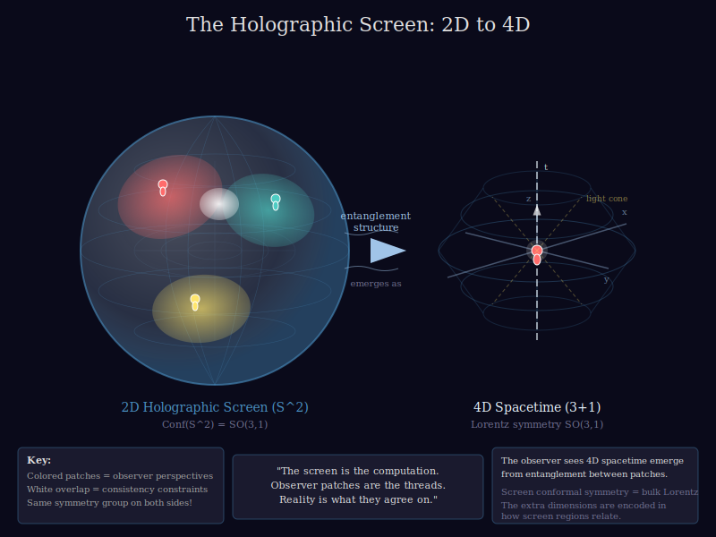
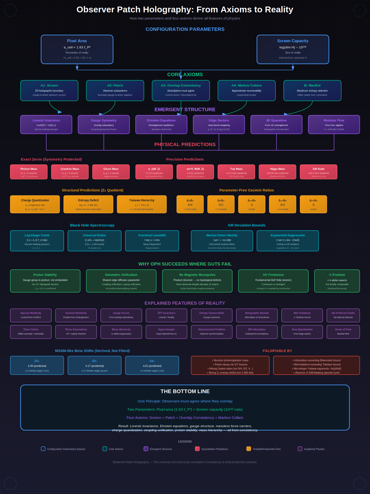

# Reverse Engineering Reality

**Download:** [Technical Paper](https://doi.org/10.5281/zenodo.18288114) | [Book (Web)](https://oth-book.lovable.app)

**Read:** [How OPH Addresses Major Open Problems in Physics](https://medium.com/@muellerberndt/answering-10-of-the-hardest-questions-in-physics-and-some-bonus-questions-51222bf2419f)

Physics is reverse engineering at cosmic scale. We observe reality's behavior and work backward to reconstruct the underlying rules. This project is an attempt to contribute to that effort.

## The Core Idea

There is no objective reality. There is only a network of subjective perspectives that must agree where they overlap.

Every piece of evidence we have for an "objective world out there" is itself a subjective experience. No one has ever stepped outside their perspective to verify that reality exists independently. The objective is always accessed through the subjective. What we call "objective" is actually *intersubjective*: the consistent overlap of many viewpoints.

**The laws of physics are what allow observers to agree on what the data means.**

## Observer Patch Holography

Our model takes this literally. We start with observer patches on a 2D holographic screen. Each patch represents a perspective with its own local data. Where patches overlap, their descriptions must agree. "Reality" is whatever survives this consistency filter. There is no world-in-itself. There are only subjective views that agree on what happened.

Lorentz invariance exists because different observers must have consistent descriptions. Gauge symmetry exists because overlapping patches must identify shared observables. Conservation laws exist because the same quantities must be conserved across all perspectives. The laws are not imposed from outside. They are the conditions that make agreement possible.

The model rests on four core concepts:

- **Screen**: A horizon-like 2D sphere (like a cosmic horizon surrounding each observer) that carries quantum information. This is where the fundamental data lives.

- **Patch**: A connected region of the screen accessible to a particular observer. Each patch has its own algebra of observables, the questions that observer can ask about reality.

- **Overlap consistency**: Where two patches share a region, their descriptions must agree. This is the central axiom. It replaces "objective reality" with "intersubjective agreement."

- **Observer**: A stable pattern within the screen data that maintains records and participates in consistency relations.

### Reality from Computation

Think of the screen as a gauge-invariant quantum system on a 2-sphere. It resembles a quantum cellular automaton, but with important structure. At each point on the triangulated sphere sit finite-dimensional quantum systems (qudits), coupled by gauge constraints at every vertex. Not all configurations are physical; only those satisfying Gauss's law survive.

**Observer patches** are subsystems defined by boundary-gauge-invariant algebras. Each patch is a computational thread: a connected region where an observer can ask questions and get answers. The algebra $\mathcal{A}(R)$ defines what that observer can measure, namely the operators invariant under boundary gauge transformations.

**Overlap consistency** is automatic. Where two patches intersect, they access the same gauge-invariant observables. Both observers are reading the same underlying data, just from different angles. The gauge redundancy at boundaries is what makes gluing non-trivial and gives rise to the "edge modes" that carry geometric information.

**Observers are not external users.** They are emergent computational structures *within* the screen data. They are stable patterns that process information, maintain records, and create correlations. Think of them as programs running on the substrate.

**The 4D bulk is not on the sphere.** It emerges from the entanglement structure between patches. The sphere is the boundary; the interior is reconstructed holographically. When you look around and see three-dimensional space, you are experiencing a compressed encoding of how your patch is entangled with others.

*The screen is the computation. Observer patches are the threads. Reality is what they agree on.*

### What Drives the Computation?

In quantum link models, the dynamics involve plaquette terms (Wilson loops around faces) and electric field terms (conjugate to the link variables). The competition between these determines the ground state. The "computation" is these quantum degrees of freedom evolving, creating and destroying correlations, with gauge constraints ensuring consistency.

Note that the "time" that observers experience isn't necessarily the microscopic Hamiltonian evolution. Each observer patch has its own modular Hamiltonian (constructed from the reduced density matrix on that patch), and *that* generates what feels like time from inside. The microscopic evolution and emergent modular time are related but distinct.

The system exists in a timeless state (as the Wheeler-DeWitt equation suggests for quantum gravity), and what we call "time" is entirely relational. Modular flow gives each subsystem its own internal clock, correlated with others through consistency conditions. The qudits don't "do" anything in the sense of changing over some external time parameter. They just *are*, in a particular entangled configuration, and "time" is how we describe correlations within that configuration from the inside.

### Why This Approach Works

Unified models attempting to combine QFT, gravity, and Standard Model structure tend to encounter a repeatable set of conceptual difficulties: subsystem factorization breaks down in gauge/gravity, modular Hamiltonians are nonlocal, Lorentz invariance is assumed rather than derived, dynamics are hard to get (not just kinematics), gauge symmetry origins are unclear, masslessness is hand-imposed, anomalies appear as mysterious pathologies, charge quantization needs GUTs, coupling unification forces proton decay, the cosmological constant is locally overdetermined, UV infinities proliferate, and parameter counts explode. The observer-patch framework addresses these by making consistency conditions do the work: it treats locality, Lorentz invariance, gauge symmetry, and gravity as *consistency constraints* among overlapping descriptions plus information-theoretic properties of states (Markov/recoverability + MaxEnt), then leans on modular theory rigidity to force the familiar symmetries and dynamics. This "structures → consistency" move is what allows the framework to naturally explain or sidestep classic unification pitfalls (see Section 8.5 of the technical paper for detailed analysis).

## The Prediction Chain

The following infographic shows how the entire framework flows from two parameters and four axioms to all features of physics:

*From axioms to reality: how overlap consistency derives all of physics.*

## The Fundamental Parameters

If the model is correct, our universe is characterized by exactly **two fundamental parameters**:

### 1. Pixel Area: $a_{\text{cell}} \approx 1.63 \, \ell_P^2$

The geometric area of a single computational element on the holographic screen. This sets the *resolution* of reality:

| Quantity | Value | Meaning |
|----------|-------|---------|
| In Planck units | $a_{\text{cell}} / \ell_P^2 \approx 1.63$ | Dimensionless ratio |
| In SI units | $a_{\text{cell}} \approx 4.26 \times 10^{-70}$ m^2 | Physical area per pixel |
| Pixel "side" | $\sqrt{a_{\text{cell}}} \approx 2.06 \times 10^{-35}$ m | Resolution scale |

**What it determines:** Newton's constant (via $G_{\text{nat}} = a_{\text{cell}}/4\bar{\ell}$ in natural units where $G_{\text{nat}} = \ell_P^2$), Planck scale, all gauge couplings, all particle masses.

### 2. Screen Capacity: $\log(\dim \mathcal{H}) \sim 10^{122}$

The total entropy of the holographic screen (in nats). This sets the *size* of reality.

**Important:** Screen capacity is **inferred from** the observed cosmological constant, not predicted. The relation

$$\Lambda = \frac{3\pi}{G \cdot \log(\dim \mathcal{H})}$$

lets us extract screen capacity from the measured $\Lambda \sim 10^{-52}$ m$^{-2}$, giving $\log(\dim \mathcal{H}) \sim 10^{122}$.

| Quantity | Value | Status |
|----------|-------|--------|
| de Sitter entropy | $S_{dS} \sim 10^{122}$ nats | Inferred from observed $\Lambda$ |
| de Sitter horizon | $r_{dS} \approx 10^{26}$ m | Observed |

**The relationship:**
- **Pixel area** = resolution (extracted from gauge couplings via edge entropy)
- **Screen capacity** = total size (extracted from observed cosmological constant)

The axiom structure contains no other dimensionful constants. The axioms plus reconstruction give *a* compact gauge group; narrowing to SU(3) x SU(2) x U(1) / Z6 specifically requires additional selectors (minimality, chirality stability) that are not yet derived from first principles. Charge quantization and Einstein's equations follow from the axiom structure once the gauge group is fixed.

### What This Means

The pixel area and screen capacity are **configuration parameters**, the "settings" of the computation that is our universe. They are not derivable from within the simulation; they are boundary conditions set from "outside."

From inside, these parameters manifest as:
- **Pixel area** determines Newton's constant, Planck scale, gauge couplings, particle masses
- **Screen capacity** determines observable universe size (but is itself inferred from the observed cosmological constant, which is not predicted)

The same axioms with different settings would produce a universe with different constants but similar physics (Einstein equations, gauge structure). The specific Standard Model gauge group requires additional selectors beyond the core axioms.

### Calibration vs Prediction

In the current implementation, the pixel constant P = a_cell/ℓ_P² is *inferred* from measured gauge couplings because the axioms fix the functional relation P = 4ℓ̄_tot(t₂,t₃) but do not yet fix the MaxEnt Lagrange multipliers t_i (equivalently the couplings) from first principles. This inference step is therefore a calibration, not a claimed prediction of P.

The nontrivial content is that P provides an additional constraint linking the gravitational coupling to gauge-sector edge entropy, and in a two-input mode (treating P as a fundamental configuration parameter and using only one electroweak datum α(M_Z)) the framework predicts α_s(M_Z) and sin²θ_W(M_Z) simultaneously.

Full non-circular closure would require a UV principle that fixes t without reference to measured couplings.

### Current Status

The framework produces:

**From core axioms (A1-A4) + MaxEnt + Euclidean regularity:**
- Lorentz kinematics (from geometric modular flow on caps)
- Semiclassical Einstein equations (via entanglement equilibrium, conditional on the EFT bridge)
- A compact gauge group (from edge-sector fusion + Tannaka-Krein reconstruction)
- Massless photon and graviton (from emergent gauge/diffeomorphism invariance)

**With additional selectors (not derived from core axioms):**
- The specific SM gauge group SU(3) x SU(2) x U(1) / Z6 (requires minimality + chirality stability selectors)
- Three generations (requires minimality + empirical CP violation + asymptotic freedom)
- Proton stability (requires sector factorization assumption)

**With SM matter content assumed:**
- Charge quantization, hypercharge ratios
- MSSM-like beta coefficients $\Delta b \approx (2.49, 4.17, 4.01)$ from edge-sector heat-kernel + Z6 quotient, matching $(2.5, 4.17, 4.0)$ to <1%
- Fermion mass hierarchy pattern $y_f \propto 6^{-n_f}$ (integer charges not yet derived)

## What the Model Derives

Our results fall into two categories: those that emerge directly from observer-patch consistency, and those that require additional assumptions.

### Direct Consequences of Patch Consistency

These results follow from the absence of a privileged "third-party" frame. There are only observer perspectives that must agree where they overlap:

**No preferred reference frame**: There is no objective vantage point from which to define absolute rest. Every observer's perspective is equally valid. This follows directly from there being no "view from nowhere." Crucially, there is no observer *outside* the sphere looking in. Observers are patterns *within* the screen data, each with access only to their own patch. The global state exists mathematically, but no entity within the model can observe it.

**Lorentz invariance**: Different observers through the same point must have consistent descriptions. The transformations relating their perspectives form a group. On S^2, this group is Conf(S^2) ~ SO(3,1), the Lorentz group. Special relativity emerges as a consistency condition. Note that the qubits on the screen do not "move." What we call motion in the emergent 4D spacetime is a pattern in how correlations change. A Lorentz boost is a transformation relating how two observers describe the same correlation pattern. The substrate is not in spacetime; spacetime emerges from how patches relate.

**Gauge symmetry as overlap redundancy**: When patches overlap, there is redundancy in how they identify shared observables. This redundancy has the mathematical structure of a gauge group. The photon and graviton are massless because mass terms would break this redundancy, making consistent gluing impossible.

**4D from 2D**: How does a 2D screen give rise to 4D spacetime? The conformal group of S^2 is isomorphic to the Lorentz group of 3+1 dimensions. The screen's symmetries *are* spacetime symmetries. The extra dimensions emerge from how screen regions relate through entanglement.

### Einstein's Equations

**Einstein's equations** are derived from the following chain:

1. *MaxEnt selection* (Assumption B): The global state maximizes entropy subject to local constraints.

2. *Local Gibbs form* (Lemma 2.6): Derived from MaxEnt + local constraints.

3. *EFT bridge* (N1-N3): The null-surface modular bridge is derived from core axioms A1-A4 under two testable conditions: (i) null strips qualify as A4 separators, (ii) local finite variation holds.

4. *QNEC/Focusing*: Derived internally via relative entropy monotonicity.

5. *Entanglement equilibrium* leads to Einstein equations via the Jacobson mechanism (1995, 2016).

The remaining explicit assumptions are MaxEnt and Euclidean regularity (for 2pi normalization).

### Particles and Forces

The gauge-as-gluing principle (Section above) reconstructs compact gauge groups from edge-sector fusion rules. Specific consequences:

**Massless photon**: The electromagnetic U(1) symmetry emerges as the redundancy structure for charged observables. A photon mass would break this redundancy, making consistent gluing impossible. Therefore the photon mass is exactly zero. Current experiments confirm this to 27 orders of magnitude.

**Massless graviton**: Diffeomorphism invariance (the symmetry underlying general relativity) emerges from the fact that bulk spacetime is a compression of screen data. A graviton mass would break this invariance. The graviton mass is exactly zero, confirmed to 22 orders of magnitude.

**Three colors**: The Witten anomaly requires an odd number of quark colors. The minimal nontrivial choice is three. *Note: This requires a minimality selector; the axioms alone don't exclude $N_c = 5, 7, ...$*

**Three generations**: CP violation requires at least three generations; asymptotic freedom allows at most five. Minimality selects three. *Note: This also requires the minimality selector plus empirical CP violation as input.*

**Proton stability** (conditional): This is where our model diverges from traditional Grand Unified Theories. Standard GUTs embed SU(3) x SU(2) x U(1) into a larger simple group, introducing leptoquark bosons that mediate proton decay. Super-Kamiokande's limit $\tau_p > 10^{34}$ years excludes minimal SU(5).

Our model takes a different path. The gauge group emerges as a *product* structure from edge-sector fusion rules, without embedding in anything larger. There are no leptoquark generators. *However, this prediction is conditional on the sector factorization assumption; if sectors don't factorize, the gauge group might not be a product.*

## How the Model Explains Known Physics

To be clear: most of what follows are *postdictions*. The photon mass, the number of quark colors, the structure of spacetime, etc. were known long before this model existed. The question is whether the model *explains* them from deeper principles, rather than taking them as inputs.

### Derived from Framework Assumptions

These results follow from the core axioms (A1-A4) plus additional assumptions (MaxEnt, gauge-as-gluing, Euclidean regularity). The full required assumption set is detailed in the technical paper.

| Result | Derivation Chain |
|--------|------------------|
| Photon mass = 0 | Given emergent gauge redundancy + unbroken U(1)_em, mass term forbidden |
| Graviton mass = 0 | Given entanglement equilibrium + diffeo invariance, mass term forbidden |
| Gluon mass = 0 | Given gauge-as-gluing for SU(3), mass term forbidden |
| Lorentz group | A1-A4 + modular covariance via BW theorem gives Conf(S^2) ~ SO(3,1) |
| CPT invariance | Lorentz kinematics + locality via CPT theorem |
| Charge conservation | Unbroken U(1)_em gauge symmetry |
| Newton's constant formula | $G = a_{\rm cell}/4\bar{\ell}(t)$ from edge entropy density |

### Derived Given Assumed Matter Content

These follow once the Standard Model matter content is assumed:

| Result | Status |
|--------|--------|
| Hypercharges (exact rationals) | SM matter content assumed |
| Charge quantization | Z6 quotient from realized spectrum |
| Z6 congruence rule | SM global group structure |
| Edge entropy deficit = log2 6 bits | Heat-kernel law + Z6 quotient |
| Yukawa hierarchy $y_f \propto 6^{-n_f}$ | Z6 defect suppression + integer charges |

### Precision Validations Against Existing Data

| Prediction | Experimental Status | Notes |
|------------|---------------------|-------|
| $\alpha_s(M_Z) \approx 0.1175$ | PDG: $0.1177 \pm 0.0009$, within 1sigma | Genuine sub-sigma match |
| $\sin^2\theta_W(M_Z) \approx 0.2311$ | PDG: $0.23129 \pm 0.00004$, 0.1% low | ~5sigma in exp. units; theory uncertainty not quantified |
| $\Lambda_{\overline{\text{MS}}}^{(5)} \approx 195$ MeV | PDG: $213 \pm 8$ MeV | ~10% low, from Dynkin-index beta |
| Higgs mass $m_H \approx 125.08$ GeV | PDG: $125.09 \pm 0.24$ GeV, within 1sigma | Requires critical surface assumption |
| Z6 charge quantization | PDG: $\|q_p + q_e\|/e < 10^{-21}$ | Structural prediction |
| Casimir log-gap ratios | Lattice SU(3) confirms 9/4, 5/2, 4, 9/2, 6 | Parameter-free ratios |
| Photon mass = 0 | PDG: $m_\gamma < 10^{-18}$ eV | Exact (gauge symmetry) |
| Graviton mass = 0 | PDG: $m_g < 1.76 \times 10^{-23}$ eV | Exact (diffeomorphism) |

### Conditional on Unproven Assumptions

These require additional selectors or assumptions not derived from the core axioms:

| Result | Required Assumption |
|--------|---------------------|
| $N_c = 3$ (three colors) | Minimality selector (assumed, not derived) |
| $N_g = 3$ (three generations) | Minimality + empirical CP + asymptotic freedom |
| Proton stability | Sector factorization assumption |
| No magnetic monopoles | Sector factorization assumption |
| Product gauge group | Sector factorization assumption |

### Consistency Checks (Not Novel Predictions)

These match known results but were derived elsewhere first:

| Result | Original Source |
|--------|-----------------|
| $(b_2, b_3) = (1, -3)$ from Dynkin indices at $t^* \approx 4/3$ | New result (reduces MSSM beta to collar geometry) |
| $\alpha_s(M_Z) \approx 0.117$ with MSSM spectrum | MSSM GUT analyses (1990s) |
| $\sin^2\theta_W(M_U) = 3/8$ | Georgi and Glashow (1974) |
| Witten anomaly constraint | Witten (1982) |
| GIM mechanism (no tree-level FCNC) | Glashow, Iliopoulos, Maiani (1970) |

### Structural Features

| Observation | How the Model Explains It |
|-------------|---------------------------|
| Holographic entropy bounds | Information lives on boundaries where observer patches meet |
| Bell violations <= Tsirelson bound | Quantum correlations are maximal consistent correlations |
| No preferred reference frame | No privileged observer exists to define one |
| Measurement affects outcomes | "Measurement" is observer synchronization |
| 4D spacetime from 2D screen | Conf(S^2) ~ SO(3,1); screen symmetries *are* spacetime symmetries |

### Novel Testable Predictions

| Prediction | How to Test | Status |
|------------|-------------|--------|
| Casimir log-gap ratios (9/4, 5/2, 4, 9/2, 6) | Future lattice measurements of SU(3) edge-sector probabilities | Parameter-free from group theory |
| Z₆ entropy deficit = log₂ 6 ≈ 2.585 bits | Edge-sector entropy measurement (~4.0 bits vs ~6.6 bits for product group) | Global-structure observable |
| BH emission line ratios $E_k/E_2 = \ln k / \ln 2$ | PBH gamma-ray analysis | Parameter-free arithmetic pattern |
| Mass-independent fractional linewidth ~3-5% | PBH emission line profiles | Shape prediction, not just positions |
| Yukawa exponents $-\ln y_f / \ln 6$ near integers | Extract from fermion masses | Ties hierarchy to Z₆ structure |
| Coupling unification without proton decay | Proton lifetime + precision coupling data | Geometric vs algebraic unification |
| GR deviation bound from Markov defect | Precision gravity tests in low-CMI regime | Exponential suppression with collar width |

### Speculative / Conditional Predictions

These predictions follow from the discrete area spectrum but require additional dynamical assumptions (e.g., that integer-multiplication transitions dominate in Hawking emission). Falsification of these would rule out the specific dynamical selection rule, not necessarily the framework.

| Prediction | How to Test | Required Assumption |
|------------|-------------|---------------------|
| GW horizon spectroscopy comb | Stack LIGO/Virgo events at $x_k = \ln k / 8\pi$; absence of coherent peaks falsifies | Integer-k transitions dominate |
| Discrete Hawking comb | PBH gamma-ray bursts should show $E_k/E_2 = \ln k / \ln 2$ structure | Integer-k transitions dominate |

## What Would Falsify the Model

The model makes strong claims and could be wrong. The following observations would falsify it:

### Physical Falsifiers

- **Nonzero photon or graviton mass**: Any confirmed mass, however small, would break the symmetry structure the model requires.

- **Proton decay via gauge bosons**: Detection of proton decay through X or Y boson exchange would indicate the gauge group is embedded in a larger simple group, contradicting the model's prediction of a product structure.

- **Information exceeding Bekenstein bound**: If more information could be stored in a region than the holographic bound permits, the screen picture would be wrong.

- **Bell violations exceeding Tsirelson bound**: Quantum mechanics saturates the Tsirelson bound. Stronger-than-quantum correlations would indicate reality has structure beyond what the model describes.

- **Unitarity violation in black hole evaporation**: If information is genuinely lost in black holes, the consistency structure would fail.

- **Absence of GW horizon spectroscopy comb**: After rescaling by remnant mass and spin, LIGO/Virgo events should show coherent spectral features at universal coordinates $x_k = \ln k / 8\pi$. Absence of this pattern in a sufficiently large dataset would falsify the log-integer area spectrum.

- **Wrong Casimir ratios in lattice data**: If future precision lattice measurements show $\Delta_8/\Delta_3 \neq 9/4$ (e.g., closer to 2.67 or 5.06), the heat-kernel edge mechanism would be falsified. The full prediction set is $\Delta_8/\Delta_3 = 9/4$, $\Delta_6/\Delta_3 = 5/2$, $\Delta_{10}/\Delta_3 = 9/2$, $\Delta_{15}/\Delta_3 = 4$, $\Delta_{27}/\Delta_3 = 6$.

- **Wrong Z₆ entropy deficit**: If edge-sector entropy measurements yield ~6.6 bits instead of ~4.0 bits (i.e., no deficit relative to the product group), the Z₆ quotient structure would be falsified.

- **Non-integer Yukawa exponents**: If the extracted exponents $-\ln y_f / \ln 6$ show no clustering near integers across fermion generations, the Z₆ defect mechanism for mass hierarchy would be falsified.

### Conceptual Falsifier

- **Proof that objective reality is necessary**: The model's central claim is that observer consistency is sufficient. No objective reality independent of observers is needed. If it could be demonstrated that some physical phenomenon *requires* a world-in-itself that exists independently of all observation, the model would be falsified.

This is worth elaborating. The question "does objective reality exist?" has been debated for millennia, but modern physics has sharpened it. Bell's theorem (1964) showed that quantum correlations cannot be explained by local hidden variables (pre-existing definite values that observers passively discover). The Kochen-Specker theorem (1967) showed that quantum observables cannot all have simultaneous definite values independent of measurement context. The PBR theorem (2012) constrained the space of "epistemic" interpretations where the quantum state merely represents knowledge.

None of these theorems *prove* that objective reality does not exist. But they progressively narrow the space for it. Each shows that another intuitive feature of objective reality (locality, non-contextuality, epistemic hiddenness) is incompatible with quantum mechanics.

The model takes the next step: rather than defending an increasingly constrained objective reality, it abandons the assumption entirely. Subjective perspectives and their consistency conditions are all there is. The "objective world" is a useful approximation (the overlap-consistent backbone that all observers share) but it is not a fundamental feature of reality.

A falsification would require showing that some phenomenon cannot be explained by observer consistency alone. No such phenomenon is currently known.

## Current Status

The model is incomplete. The main gaps are:

1. **Screen microphysics**: Quantum link models on a triangulated sphere realize the regulator premises (R0/R1) and give edge-center completion and Markov collars automatically. Open: ensuring modular flow becomes geometric conformal dilation in the continuum limit.

2. **EFT bridge**: The null-surface modular bridge is derived from the core axioms under two testable conditions. Open: verify these conditions in explicit UV regulators.

3. **Standard Model selection**: The reconstruction yields *a* compact gauge group. Why specifically SU(3) x SU(2) x U(1) rather than some other product? Selectors exist (minimality, chirality stability) but are not derived from core axioms.

4. **Newton's constant**: Derived as $G = a_{\rm cell}/4\bar{\ell}(t)$ from edge entropy density. The UV-scheme gap is closed.

5. **Particle masses**: The electroweak scale ($v \approx 243.5$ GeV, 1.1% accuracy) and top mass ($m_t \approx 172.2$ GeV, 0.3% accuracy) are now derived from dimensional transmutation. The fermion mass hierarchy reduces to discrete Z6 defect charges ($y_f \propto 6^{-n_f}$), eliminating continuous Yukawa parameters. Light fermion masses (electron, up/down quarks) require deriving the integer charges from UV structure.

6. **Cosmological constant**: Structurally explained: Λ = 3π/(G · log dim H_tot) derives from screen capacity, and null modular data cannot fix Λ locally (it lives in a quotient ambiguity). The numerical value is inferred from observation, not predicted from first principles.

7. **Strong CP problem**: theta_QCD is not predicted.

## Contents

### [Technical Paper](paper/PAPER.md)
The formal development: axioms, theorems, proofs, and gap analysis.

### Book Chapters

| Chapter | Title | Topic |
|---------|-------|-------|
| [Prologue](book/prologue.md) | Prologue | Setting the stage |
| [1](book/chapter-01-consistency.md) | Consistency | Observer agreement as the fundamental principle |
| [2](book/chapter-02-lineage.md) | Lineage | Historical roots of holographic ideas |
| [3](book/chapter-03-screen.md) | The Screen | Holographic screens and information bounds |
| [4](book/chapter-04-entropy.md) | Entropy | Thermodynamics and the arrow of time |
| [5](book/chapter-05-algebra.md) | Algebra | The mathematical structure of observables |
| [6](book/chapter-06-overlap.md) | Overlap | Consistency conditions and Bell's theorem |
| [7](book/chapter-07-recovery.md) | Recovery | Information preservation and quantum error correction |
| [8](book/chapter-08-holography.md) | Holography | AdS/CFT and bulk reconstruction |
| [9](book/chapter-09-entanglement.md) | Entanglement | Geometry from quantum correlations |
| [10](book/chapter-10-error-correction.md) | Error Correction | Reality as a quantum code |
| [11](book/chapter-11-maxent.md) | MaxEnt | Entropy, time, and modular flow |
| [12](book/chapter-12-symmetry.md) | Symmetry | Conservation laws from consistency |
| [13](book/chapter-13-desitter.md) | De Sitter | Our universe's holographic screen |
| [14](book/chapter-14-standard-model.md) | Standard Model | Particles from gluing constraints |
| [15](book/chapter-15-relativity.md) | Relativity | Spacetime from modular time |
| [16](book/chapter-16-matter.md) | Matter | Classical physics as emergent stability |
| [17](book/chapter-17-darwin.md) | Darwin's Laws | Laws as evolutionary survivors |
| [18](book/chapter-18-synthesis.md) | Synthesis | Putting it all together |
| [19](book/chapter-19-metaphysics.md) | Metaphysics | Qualia and the hard problem |
| [Epilogue](book/epilogue.md) | Epilogue | One last surprise |

## Building Your Own Reality Simulator

Here's a thought that brings the project full circle: once you've reverse engineered how something works, you can build it yourself.

The screen model is a specification for a particular kind of quantum system: a gauge-invariant lattice on a closed 2D surface with the right entanglement structure. In principle, we could build one.

Current quantum computing architectures are approaching the required ingredients. Topological quantum computing, particularly Microsoft's approach using Majorana fermions, naturally implements non-abelian anyons that could realize the edge sectors our model requires. Fractional quantum Hall states already exhibit the kind of topological order and boundary physics that the screen demands. Quantum link models on triangulated surfaces have been simulated on trapped-ion and superconducting platforms.

A small-scale implementation wouldn't recreate our universe (the screen has $\sim 10^{122}$ degrees of freedom). But it could test whether the claimed emergent properties actually emerge: whether gauge symmetry appears at patch overlaps, whether something like spacetime geometry reconstructs from entanglement, whether observer-like subsystems can form and synchronize.

Where would patches be? They would emerge from the dynamics. The system evolves under a local Hamiltonian (plaquette terms creating and destroying flux loops, electric field terms penalizing large fluxes, gauge constraints at every vertex). Under this evolution, stable correlation patterns spontaneously form. Regions with high internal mutual information but lower correlation to the outside become natural patches. We wouldn't draw them beforehand; we'd watch them self-organize.

Note that Hamiltonian evolution is not the same as the time experienced "inside". The microscopic dynamics tick away according to our external laboratory clock. But any observer-like pattern that emerges within the simulation has its own modular flow, its own internal sense of time constructed from the density matrix on its patch. The lab clock and the simulated observer's clock are related but distinct. We'd be watching from outside as the qudits evolve, while any emergent observers inside would experience their own temporal flow, potentially at a completely different rate or structure.

This is speculative, but it's not science fiction. The physics is well-defined enough to simulate. If the model is right, the ultimate validation wouldn't be a mathematical proof. It would be switching on a small holographic screen and watching spacetime flicker into existence.

## Contributing

For corrections, suggestions, or additions, please open a pull request.

## License

This work is licensed under [CC BY-NC 4.0](https://creativecommons.org/licenses/by-nc/4.0/). You are free to share and adapt this material for non-commercial purposes with attribution.

(C) Bernhard Mueller 2026
